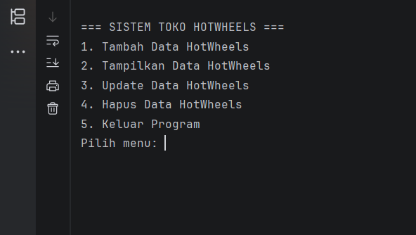
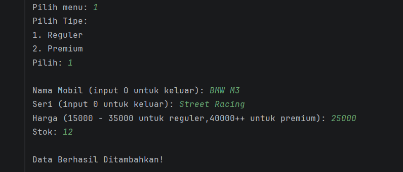
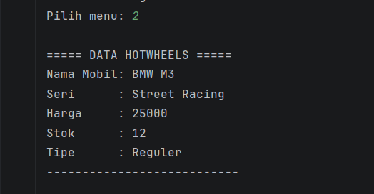
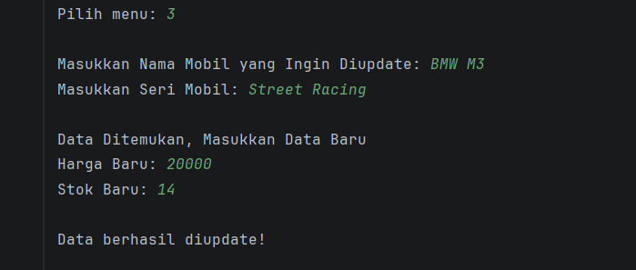
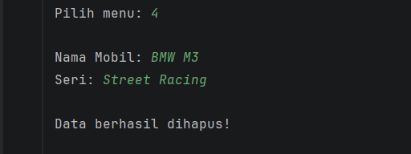
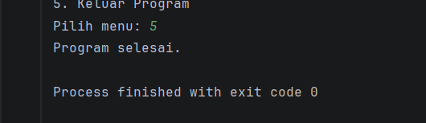

# Sistem Manajemen Toko HotWheels

## Deskripsi Program
Program ini merupakan aplikasi sederhana berbasis Java yang digunakan untuk mengelola data mobil HotWheels pada sebuah toko. Program ini menerapkan konsep dasar Pemrograman Berorientasi Objek (PBO) dengan menggunakan class dan object.

## Fitur Program
Program memiliki fitur CRUD (Create, Read, Update, Delete) menggunakan struktur data ArrayList.
### Menu Utama

### Tambah data mobil HotWheels

### Menampilkan seluruh data mobil

### Mengubah data mobil

### Menghapus data mobil

### Keluar dari program
   

## Konsep PBO yang Digunakan
- Class
- Object
- Method
- ArrayList
- Perulangan Menu

## Struktur Program
- HotWheels.java → Class untuk menyimpan data mobil
- Main.java → Program utama untuk menjalankan menu CRUD
- Toko → Class untuk menyimpan fungsi dari fitur program

## Cara Menjalankan Program
1. Compile file Java
2. Jalankan class Main
3. Pilih menu sesuai kebutuhan